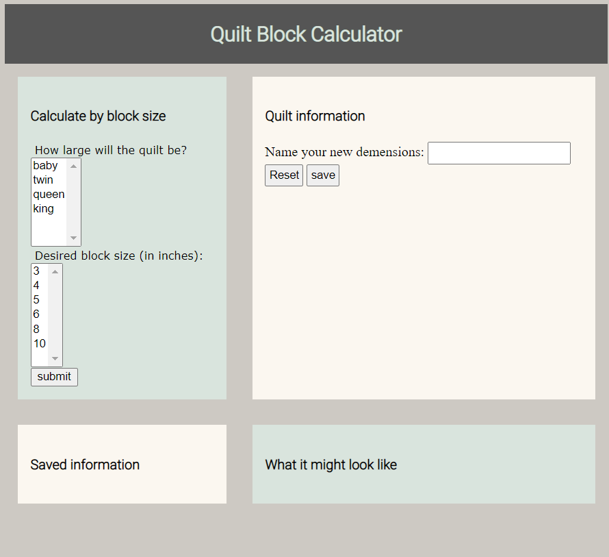
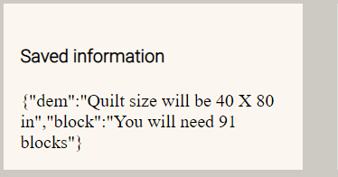

# Overview
This is my final as it currently stands. I had a lot of complications on getting the local save storage to work. It is still not working and I have looked high and low and I am not very sure what I am doing wrong. It looks right according to other code examples, but of course there is something missing. 

* this is the initial look of the web app. It has four sections, the first being the choose option, the top right being the display results, bottom left saving those results, and bottom right being the area where it would animate the quilt size. 

* We can choose the options provided on the top left and they will be displayed on the bottom left. 

* this is where i run into issues, i have the local file pulled up, but it does not look right and it does not actually save to the local file. 

